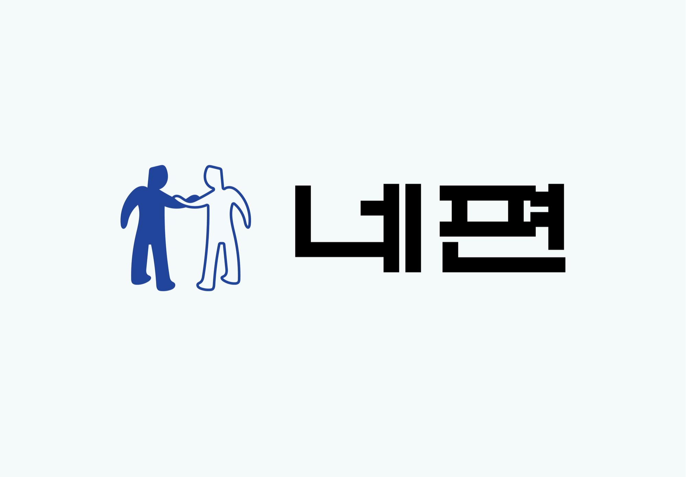

# Your-Side

## Your-Side는 네편 입니다.
근로계약서 검토 너무 어려우신가요?

나는 지금 알맞은 월급을 받고 있을까요?

세세한 근로법이 어려운 ***‘네편’*** 이 되어줄 [네편]()에서 확인해세요!

## Project-한줄평
- 4Bee/김동우 : 우여곡절이 많았지만 끝까지 프로젝트를 마칠 수 있어서 팀원들고 기다려준 많은 분들게 감사하다고 전하고 싶습니다. 앞으로 있을 버전 2도 열심히 준비해서 좋은 모습 보여드리 겠습니다.

- 임혜정 :

- 윤예진 :

# Front-Skill

### Configuration and PackageManager

### Code Quality and Formatting

## Tool

## Distribution

# introduce

### Main Page

### Page

### Page

### Page

### Page

## Project Contributors

|   |   |   |   |
|---|---|---|---|
|  |  |  |
 Frontend | Backend/Frontend | Frontend |
[4Bee/김동우](https://github.com/4BFC) | [임혜정](https://github.com/frombunny) | [윤예진](https://github.com/nyun-nye) |

